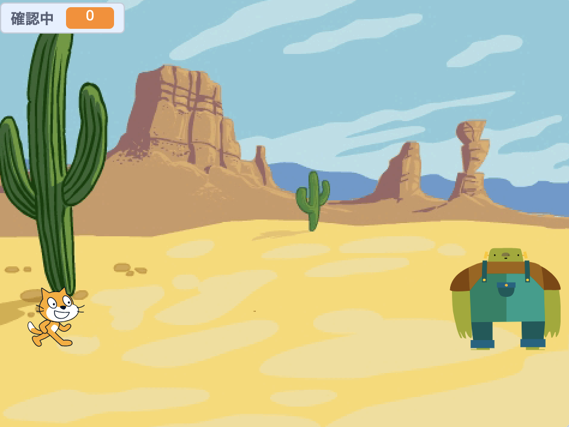
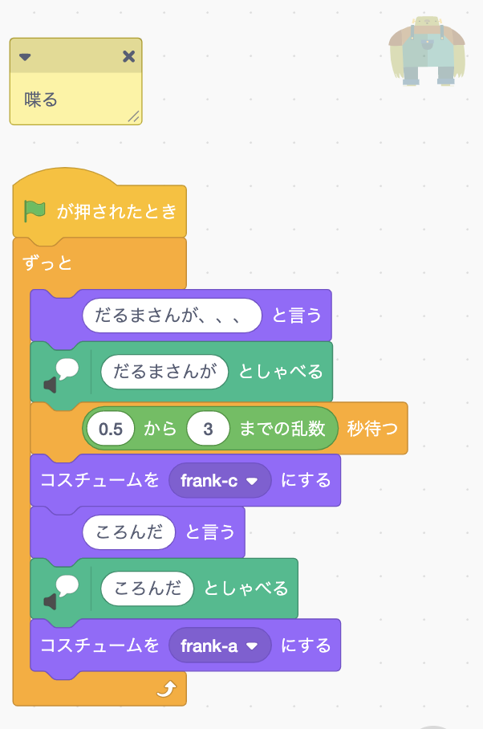
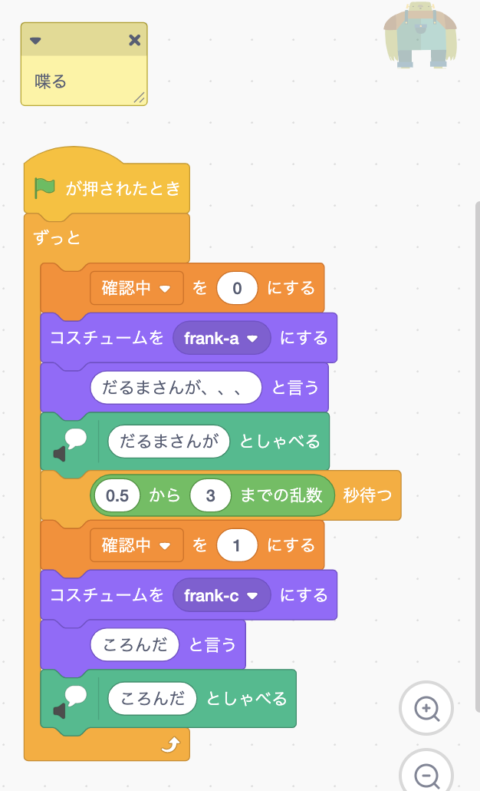

# だるまさんがころんだ

簡単な「だるまさんがころんだ」のゲームです。 
https://scratch.mit.edu/projects/535403136  
 

## ステージ、キャラのサイズを整える
好きな背景にし、キャラと鬼のサイズを整えます。 
x座標を進んで行くと鬼に当たる位置に配置します。
推奨サイズ(cat50 、Frank50） 

## 鬼の動き
 
フラッグ押された時 
ずっと 
「だるまさんがという」 
「だるまさんがと喋る」 
「0.5~3.0秒待つ」 
「ころんだいう」 
「だるまさんがと喋る」 
を繰り返します！ 
**途中「0.5~3.0秒待つ」で待機時間をランダムにするのがポイントです！**  

## 確認中の変数の作成
 
「確認中」という変数を作成して、「だるまさんが〜」の時は0、 
「ころんだ！」で後ろをチェックしてる時は1の値を入れるようにします。 
これで鬼側「今回はFlank」は制作完了です！

## プレイヤーの基本的な移動

プレイヤーのプログラムを組みます。 
１、旗が押されたら初期値に戻す 
２、ずっともし右キーが押されたら1歩動かす 
の基本操作を作ります。

## プレイヤーが見つかった時の処理

移動中に、もし発見されたら、「右キーが押してる かつ 確認中変数が1」の時 
「やられた〜」と発言して、初期座標に戻すプログラミングをしてあげます。 

## プレイヤーが勝利した時のプログラム
 
プレイヤーが移動して、鬼の位置に辿り着いた（衝突）ら勝利です！ 
「いえーい、かった！」など勝利宣言して、また初期値に戻しましょう。  

## 自由にアレンジしてみよう
BGMをつけたり、プレーヤーの速度や、鬼の確認の速度調節したりして のして自由にアレンジしてみましょう、

